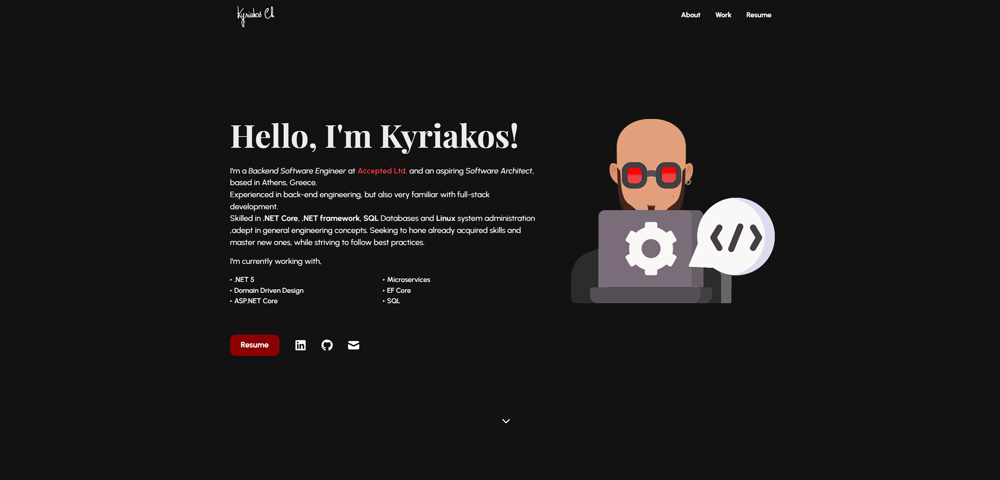
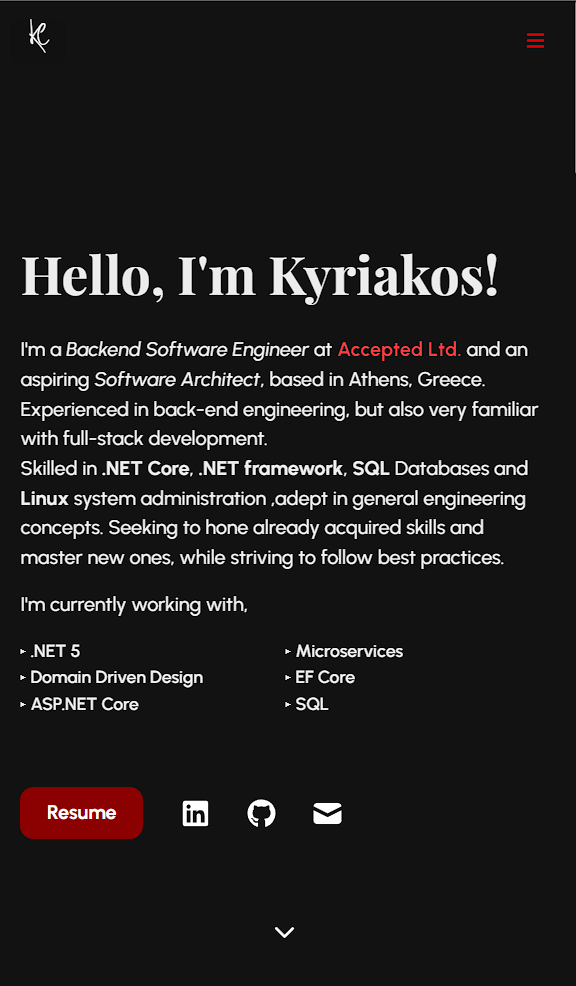

# Portfolio 




---
## Installation

### Setup 

To install the node packages used in the project:

```shell
$ yarn install
```
For development

```shell
$ yarn start
```

For production
```shell
$ yarn build
```